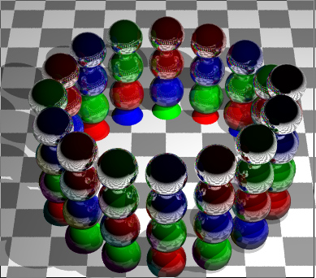
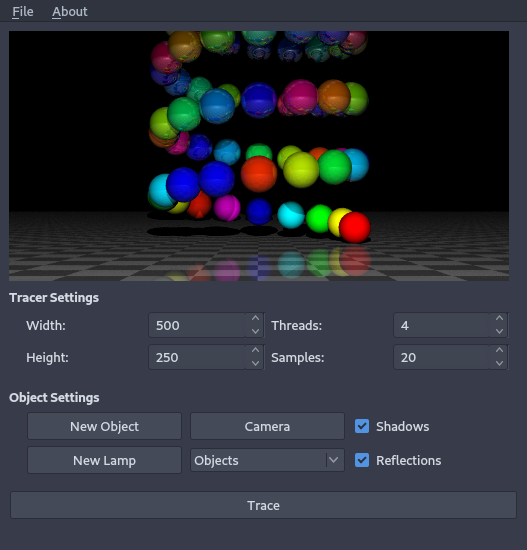

# Tracer

### Description:

Tracer is a demo ray tracer written with C++.

### Dependancies:

- GCC, or sad Windows imitation (via [MinGW](http://mingw.org/), [Cygwin](https://cygwin.com/), [Bash for Windows](https://msdn.microsoft.com/en-us/commandline/wsl/about), etc.)
- Qt5

### Compiling:

Run `make` in the top level directory.

### Running:

Run `./exec.sh` in the top level directory.
